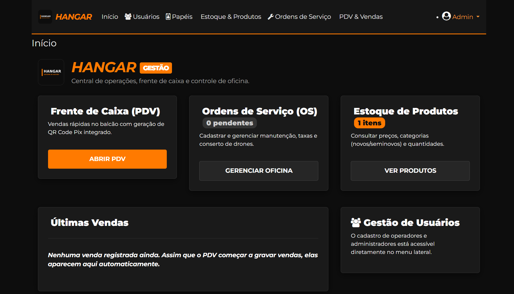
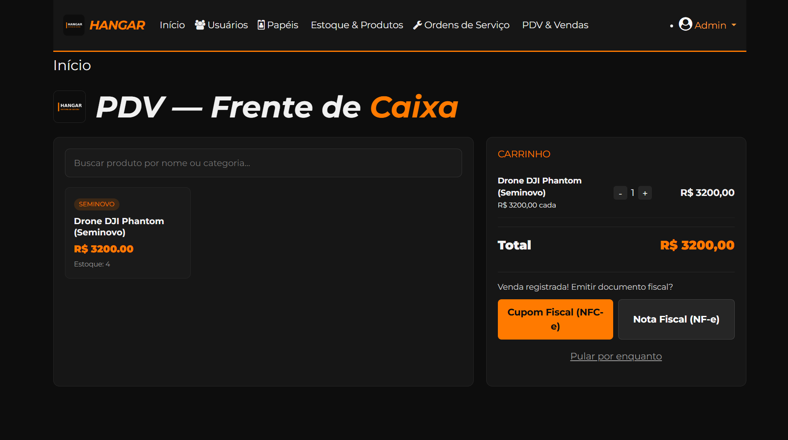
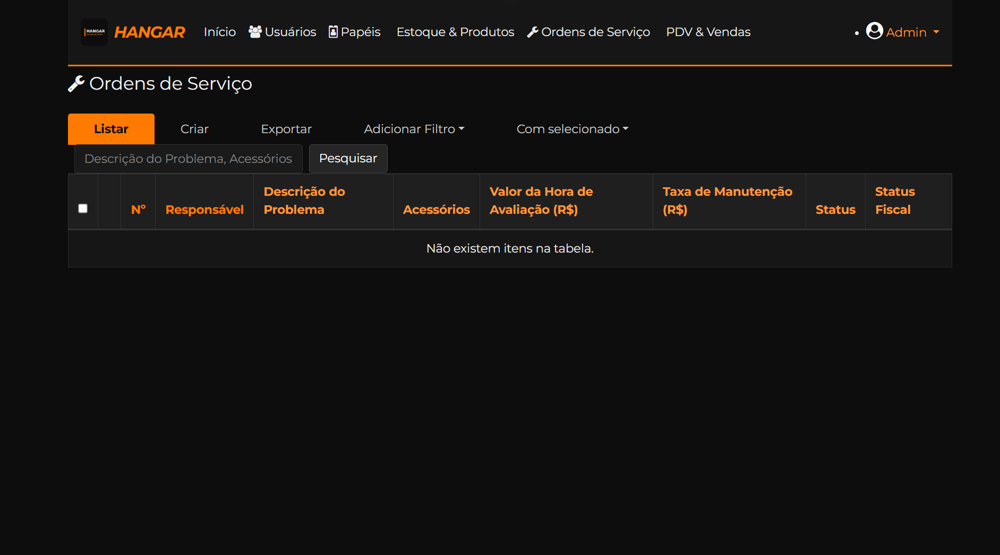
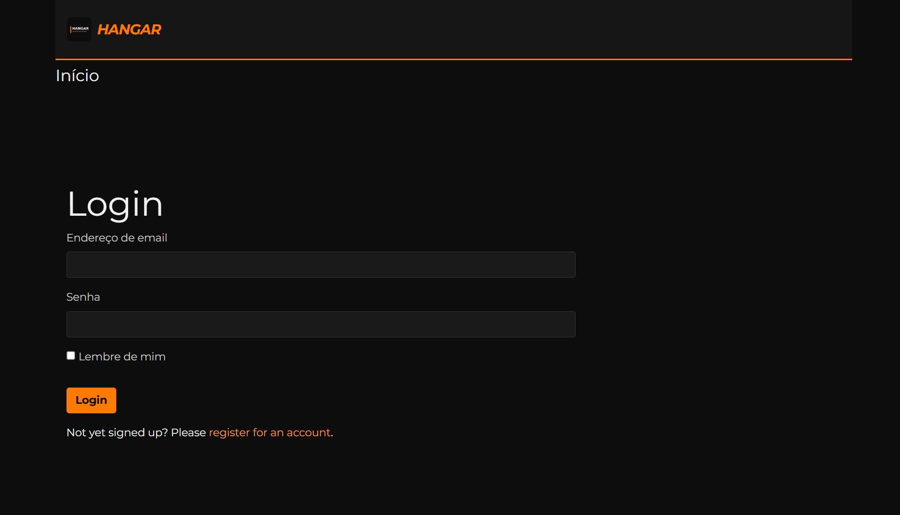

# Hangar — Sistema de Gestão Comercial & PDV

Sistema desenvolvido sob medida para a **Hangar**, unificando em um único lugar o que antes era espalhado por vários sistemas genéricos: frente de caixa, controle de oficina, estoque, comissões e emissão fiscal.

Construído em Flask + Flask-Admin, com identidade visual própria (preto e laranja) e integração fiscal real (NFC-e/NF-e via Focus NFe) e Pix.

## ✨ Funcionalidades

- **PDV (Frente de Caixa)** — venda rápida no balcão, com busca de produtos, carrinho dinâmico e baixa automática de estoque
- **Ordens de Serviço (Oficina)** — controle de avaliação e manutenção de drones, com isenção automática da taxa de avaliação quando o conserto é realizado
- **Comissão automática por categoria** — calculada sozinha (produto novo, seminovo ou peça), sem planilha
- **Trava de preço mínimo** — impede vender abaixo do valor de segurança por engano
- **Emissão fiscal** — Cupom Fiscal (NFC-e) e Nota Fiscal (NF-e) direto do sistema, via Focus NFe
- **Pix integrado** — geração de QR Code (Pix estático/BR Code) com o valor exato da venda, sem depender de gateway pago
- **Painel gerencial** — métricas mensais (faturamento, ticket médio, ranking de vendedores), visível apenas para o papel "dono"
- **Controle de acesso por papéis** — usuários, superusuários e dono têm visões diferentes do sistema

## 📸 Capturas de tela

<!-- Substitua os arquivos em screenshots/ pelos prints atuais do sistema e ajuste os nomes abaixo se necessário -->

| Dashboard | PDV |
|---|---|
|  |  |

| Ordens de Serviço | Login |
|---|---|
|  |  |

## 🚀 Como rodar localmente

1. Clone o repositório e crie o ambiente virtual:
   ```
   python -m venv venv
   venv\Scripts\activate
   pip install -r requirements.txt
   ```

2. Copie o arquivo de configuração de exemplo e preencha com seus valores reais:
   ```
   copy config.example.py config.py
   ```
   Edite `config.py` com sua chave secreta, token da Focus NFe (homologação é gratuito) e chave Pix.

3. Rode o sistema:
   ```
   python app.py
   ```

4. Acesse `https://localhost:5000` — na primeira execução, o sistema cria automaticamente um usuário administrador de exemplo (veja `app.py` para as credenciais padrão de teste).

## 🔒 Segurança

O arquivo `config.py` contém dados sensíveis (tokens, chaves) e **nunca é versionado** — está no `.gitignore`. Use sempre `config.example.py` como referência de quais variáveis preencher.

## 🛠️ Stack

Flask · Flask-Admin · Flask-Security · SQLAlchemy · Flask-Babel (i18n pt-BR) · Focus NFe (fiscal) · Pix (BR Code / QR estático)